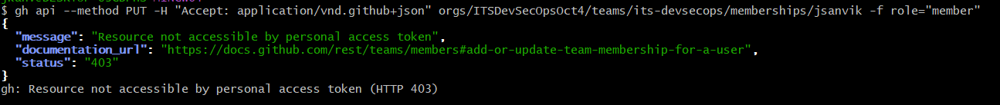

# Setup Requirements
1. An active GitHub account.
2. The GitHub account names for all of the students.

# Setting Up the Activity
## Create a GitHub organization and team for the activity
1. Create a Free organization at https://github.com/organizations/plan
   - A suggested name would be a combination of the course (e.g. CPSC 3720) and the semester (Fall 2025)
2. Create a team for the organization called "ITS DevSecOps"
    - Leave the visibility as `Visible`
    - Change notifications to `Disabled`
1. Set the default permissions for team members to be `Write` so students can create issues.
   - Go to `Settings` for the Organization
   - Select `Member Privileges`
   - Set `Base permissions` to `Write`

## Create the ITS DevSecOps Adventure repository
1. Return to https://github.com/johnanvik/devops-colouring
1. Click the button "Use this template" in the upper right corner to create a new copy of the repository.
1. Change the owner of the repository to the newly created organization.   
1. Call the new repository "ITS DevSecOps Adventure"
1. Leave the visibility as "Private"
1. Create the repository by clicking "Create repository"
2. In `Settings`, under `Features`, turn on `Issues` (if not already done so).

## Configure the repository (requires GitHub CLI to be installed)
1. Open a terminal 
1. Login using the GitHub CLI
   - `gh auth login` and follow the prompts
1. Run the script `copylabels.sh` in the `scripts` folder
   - `scripts/copylabels.sh <organization name> <repository name>
      - Example: scripts/copylabels.sh CPSC3720Fall2025 ITS-DevSecOps-Adventure
1. Confirm that labels were created.
     - Expected labels include "Batch Size", "Price", "Team 1", etc.

## Create the ITS DevSecOps Adventure project
1. Go to https://github.com/orgs/DevSecOpsAdventure/projects/2
1. Click "Use this template" in the upper righthand corner.
1. Select the orgranization you created as the `Owner`.
1. Enter "ITS DevSecOps Adventure" as the name of the project.
1. Click "Use Template"
1. (Needs to be set to private?)
### Giving students permission to the project board
1. Go to `Settings` of the project board (three dots on right, under the profile picture)
1. Select `Manage Access` from the left-side panel.
1. Enter "ITS DevSecOps" (the team you created) inthe `Invite Collaborators" search.
1. Add the team with `Write` permissions

# Adding Collaborators
## Adding students to the project's team

### For now, this needs to be done manually by sending an invite to each student

1. Make a local clone of https://github.com/johnanvik/devops-colouring 
1. Create a CSV file called `students.csv` in the scripts folder
1. Add the GitHub user names of all the students to the CSV file, one user name per line.
1. On a Unix command-line run the following commands:
   - `gh auth login`
        - Log into GitHub from the commandline
        - You may need to create a fine-grained personal access token for the organization (https://docs.github.com/en/organizations/managing-programmatic-access-to-your-organization/setting-a-personal-access-token-policy-for-your-organization)
           - Go to `Organizations` under your account  
           - Set the owner to the created organization
           - Set Repository Access to "All repositories"
           - Set the permissions to "Adminstrator"
    - `./add-users-to-team-from-list.sh students.csv <org> its-devsecops`
        - \<org> is organization you created for this activity.
        - DOESN"T WORK! GET THE FOLLOWING: 

    
1. Students will need to accept the invite to the team before they can be added to the project.

## Adding students to the project
### For now, this needs to be done manually AFTER sending an invite to each student and they accept

1. Run `./add-all-students-to-project.sh <org> "ITS DevSecOps Adventure" <project-number>`
 - \<org> is organization you created for this activity.
 - \<project-number> is the number appearing at the end of the URL for your project (e.g. "1")

# Training
TODO: Create a tutorial video showing how to use GitHub project (or find one?)
